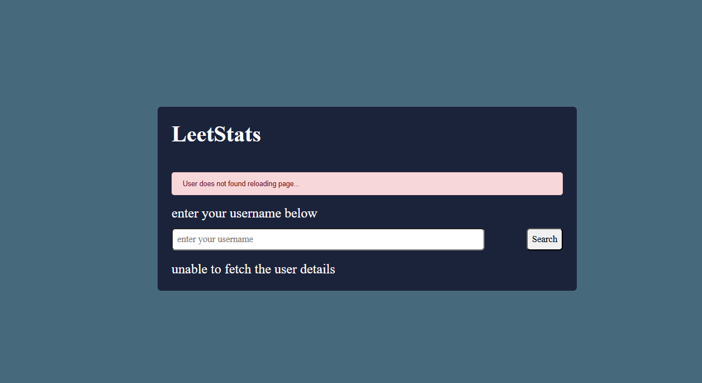

# LeetStat 🔍

LeetStat is a simple and responsive web application that lets users view their LeetCode problem-solving statistics by entering their username.
It fetches real-time data using the public LeetCode Stats API and presents it in a clean, easy-to-read format.

---

## 🔗 Live Demo

[Click here to view the project](https://ishitamangla.github.io/LeetStats/)

## ✨ Features

- 📊 Visual representation of solved Easy, Medium, and Hard problems
- 🔄 Dynamic circular progress indicators
- ✅ Real-time validation for username format using RegEx
- 🚨 Error handling with alert messages

---

## 🛠️ Technologies Used

- **HTML5** – Structure of the web page
- **CSS3** – Styling using Flexbox and modern layouts
- **JavaScript (Vanilla)** – DOM manipulation and API handling
- **LeetCode Stats API** 

---

## 🔗 API Used

This project uses the public **LeetCode Stats API** to fetch a user's problem-solving data.

 **API Endpoint Format**:

const url = `https://leetcode-stats-api.herokuapp.com/${username}`;

## 📷 Screenshot

### ✅ Valid Username

### ❌ Invalid Username

---

## 🚀 How to Run the Project

1. **Clone or Download** this repository.
2. Open the folder and launch `index.html` in your browser.
3. Enter any **valid LeetCode username** and click **Search**.
4. View statistics including:
   - Total questions solved
   - Progress by difficulty
   - Acceptance rate, rank, and reputation

---

## 📁 Folder Structure

leetstat/
├── index.html # Main HTML file
├── style.css # CSS for layout and styling
├── index.js # JavaScript for functionality
├── favicon.png # browser icon
├── validUserName.png # Shows the screenshot image when username is valid
├── invalidUserName.png # Shows the screenshot image when username is invalid
└── README.md # This file

---

## 🧠 What I Learned

- DOM element targeting and event handling
- Asynchronous operations using `fetch()`
- Handling API responses and errors
- Real-time form validation using Regular Expressions
- Clean UI structuring with Flexbox and CSS classes
- Hosting frontend-only projects using GitHub Pages

---

## 🙌 Acknowledgements

- Built while learning from [CodeHelp by Love Babbar]
- UI structure, validation, and features customized for personal practice

---

## 📄 License

This project is open-source and free to use for learning or educational purposes.

---
